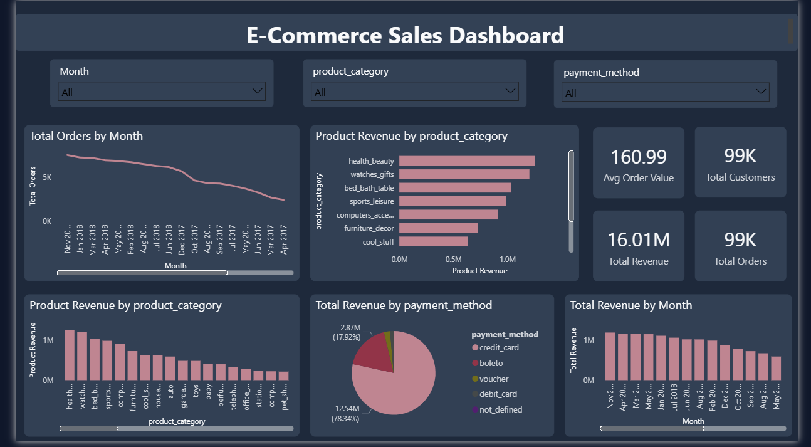
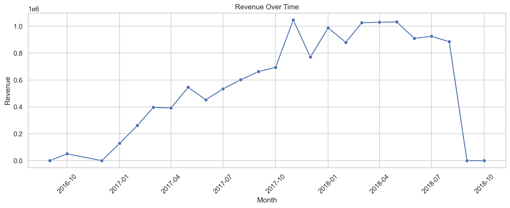
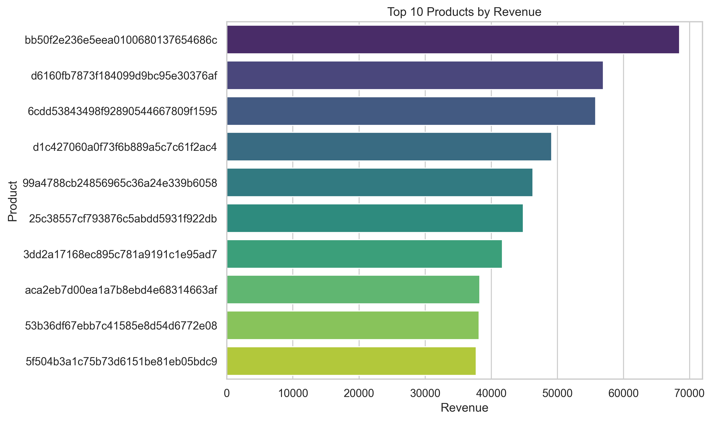
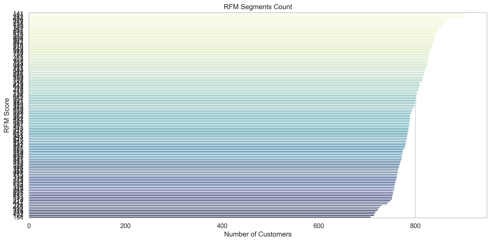

# 🛒 SQL + Python E-Commerce Analytics Project

## 📌 Overview

This project analyzes **100K+ e-commerce transactions** using SQL and Python to uncover insights into customer behavior, product performance, and revenue trends. The goal is to support data-driven decision-making for business growth.

---

## 🎯 Business Problem

E-commerce businesses often struggle to:

- Identify high-performing products  
- Understand customer purchasing behavior  
- Track revenue trends and seasonality  
- Improve customer retention strategies  

This project solves these problems using data analysis and visualization.

---

## ⚙️ Tech Stack

- SQL (MySQL) – Data querying & transformation  
- Python (Pandas, NumPy) – Data analysis  
- Matplotlib & Seaborn – Data visualization  
- Jupyter Notebook – Exploratory Data Analysis  
- Power BI – Interactive dashboard  

---

## 📂 Project Structure

```
sql-python-analytics/
│
├── data/
│ ├── raw/
│ └── processed/
│
├── notebooks/
│ └── exploration.ipynb
│
├── python/
│ ├── data_export.py
│ └── filter_inserts.py
│
├── sql/
│ ├── schema.sql
│ ├── load_data.sql
│ ├── analysis_queries.sql
│
├── dashboard/
│ ├── ecommerce_dashboard.pbix
│ └── dashboard_preview.png
│
├── visuals/
│ ├── revenue_over_time.png
│ ├── rfm_segments.png
│ └── top_products.png
│
├── reports/
│
├── README.md
└── requirements.txt

---

## 📊 Key Insights

* 📈 **Revenue Trend:** Sales show clear monthly variation, indicating seasonal demand patterns
* 🏆 **Top Products:** A small group of products contributes a significant portion of total revenue
* 👤 **Customer Behavior:** Repeat customers generate higher total spending compared to one-time buyers
* 📦 **Order Trends:** Order volume growth aligns with revenue spikes, confirming consistent demand patterns
* 💰 **Average Order Value:** Identified typical spending per transaction to guide pricing strategies

---

## 📊 Interactive Dashboard

### 📁 Power BI File
`dashboard/ecommerce_dashboard.pbix`

### 📸 Dashboard Preview


## 📈 Business Impact
- Identified top-performing products contributing a major share of revenue  
- Discovered seasonal revenue trends useful for demand forecasting  
- Highlighted high-value customers for targeted marketing strategies  
- Provided insights to optimize pricing and improve sales performance  

## 📊 Visual Insights





## 🧠 Sample SQL Queries

### 📅 Monthly Revenue Analysis

```sql
SELECT 
    DATE_FORMAT(order_purchase_timestamp, '%Y-%m') AS month,
    SUM(payment_value) AS revenue
FROM orders o
JOIN payments p ON o.order_id = p.order_id
GROUP BY month
ORDER BY month;
```

### 🏆 Top Products by Revenue

```sql
SELECT 
    product_id,
    SUM(price) AS revenue
FROM order_items
GROUP BY product_id
ORDER BY revenue DESC
LIMIT 10;
```

---

## 🚀 How to Run

1. Run `schema.sql` to create database tables
2. Run `load_data.sql` to insert data
3. Execute `analysis_queries.sql` for insights
4. Open Jupyter Notebook for Python-based analysis

---

## 📈 Results & Impact

* Enabled identification of high-revenue products
* Provided insights into customer purchasing behavior
* Highlighted trends for better marketing decisions
* Demonstrated end-to-end data analysis workflow

---

## 💡 Future Improvements

* Build interactive dashboard using Power BI or Tableau
* Apply machine learning for customer segmentation
* Deploy as a web-based analytics dashboard


